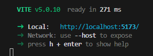

# 1.Vite构建化工具初始化项目

## 01.项目初始化

在命令行中使用`npm`构建项目

```nginx
npm create vite@latest
```

然后会出现一些选项，按照如下内容选择即可：

```markdown
Project name: syt
Select a farmework: Vue
Select a variant: TypeScript
```

安装依赖`node_modules`

```nginx
cd syt
npm i
```

运行项目

```nginx
npm run dev
```

然后可以得到如下提示



在浏览器中进入`localhost:5173`出现如下页面说明项目初始化成功：


## 02.准备工作

1. 删除`public`文件夹下的文件
2. 删除`src/assets`下的文件
3. 删除`src/components`下的文件
4. 删除样式文件`style.css`

`App.vue`暂时重置为如下内容：

```vue
<template>
  <div>
    app
  </div>
</template>

<script setup lang="ts">

</script>

<style scoped></style>
```

`main.ts`暂时重置为如下内容：

```typescript
// Vue3框架提供的createApp方法，可以用来创建应用实例方法
import { createApp } from 'vue'
// 引入根组件App
import App from './App.vue'
// 利用createApp方法创建应用实例
const app = createApp(App)
// 将应用实例挂载到挂载点上
app.mount('#app')
```

`index.html`暂时重置为如下内容：

```HTML
<!doctype html>
<html lang="en">

<head>
  <meta charset="UTF-8" />
  <link rel="icon" type="image/svg+xml" href="/vite.svg" />
  <meta name="viewport" content="width=device-width, initial-scale=1.0" />
  <title>尚医通</title>
</head>

<body>
  <div id="app"></div>
  <script type="module" src="/src/main.ts"></script>
</body>

</html>
```

`package.json`配置文件：

```json
"scripts": {
  "dev": "vite --open",
  "build": "vue-tsc && vite build",
  "preview": "vite preview"
},
```

`vite.config.ts`配置文件：

先安装`@types/node`依赖

```nginx
npm install --save @types/node
```

```typescript
import { defineConfig } from 'vite'
import vue from '@vitejs/plugin-vue'

// 引入node提供内置模块path:可以获得绝对路径
import path from 'path'
export default defineConfig({
  plugins: [vue()],
  resolve: {
    alias: {
      // 将src文件夹路径别名设置为 @
      "@": path.resolve(__dirname, 'src')
    }
  }
})
```

`tsconfig.json`配置文件：

找到配置项`compilerOptions`添加配置,这一步的作用是让 IDE 可以对路径进行智能提示

```json
 "baseUrl": ".",
  "paths": {
   "@/*": ["src/*"]
  }
```

# 2.项目静态搭建与组件拆分

安装`scss`文件依赖：

```nginx
npm install -D sass
```


在`src`目录下新建文件夹`style`用于放置样式文件

在`src/style`文件夹下创建清除默认样式文件`reset.scss`，写入内容。

在`main.ts`中加入如下代码：

```typescript
// 引入清除默认样式
import '@/style/reset.scss'
```

